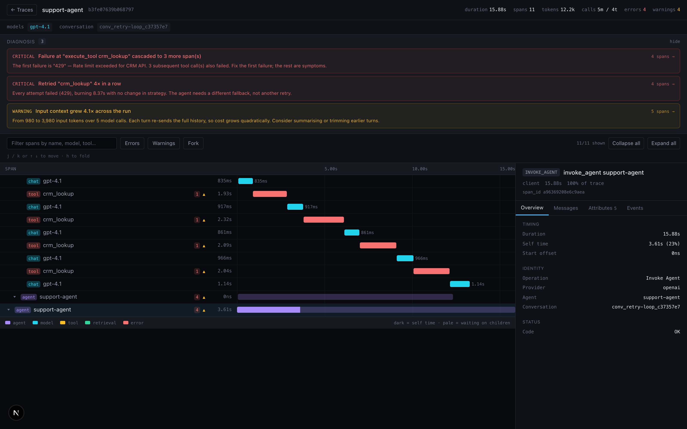

<div align="center">

# ReactAgentDebugger

**Stop guessing why your AI agent failed. Replay it.**

[](https://nextjs.org)
[](https://opentelemetry.io)
[](https://www.typescriptlang.org)
[](#testing)
[](#license)

</div>

<p align="center">
  <strong>English</strong> · <a href="./README.zh-CN.md">简体中文</a>
</p>

<p align="center">
  
</p>

---

Your agent ran 14 steps, burned 40k tokens, and returned a confidently wrong answer.

Logs tell you **what** it did. A dashboard tells you **when**. Neither tells you **why** — and neither lets you ask the only question that actually fixes the bug:

> *"What if that one tool call had succeeded?"*

ReactAgentDebugger ingests OpenTelemetry GenAI spans and gives you something you can actually debug: a structured timeline, automatic diagnosis, and **time travel** — fork the run at any step, change one thing, and re-run it.

---

## Why not just use existing tools?

| | Logs / `print()` | APM dashboards | ReactAgentDebugger |
|---|---|---|---|
| See the reasoning → tool → observation loop | ✗ flat lines | partial | ✓ agent-shaped waterfall |
| Names the actual failure mode | ✗ you read it | ✗ you read it | ✓ 8 automatic detectors |
| Re-run from a specific step | ✗ | ✗ | ✓ **Fork & Replay** |
| Test a counterfactual ("what if it hadn't timed out") | ✗ | ✗ | ✓ **override any tool result** |
| Prove a fix actually helped | ✗ | ✗ | ✓ side-by-side *Resolved / Persisted / Introduced* |
| Find systematically bad tools across all runs | ✗ | ~ | ✓ cross-run p50/p95 & error rates |
| Vendor-neutral input | ✗ | varies | ✓ **OpenTelemetry GenAI semconv** |

It is a **debugger**, not a dashboard. A dashboard shows you data and leaves the interpretation to you; this names the problem, points at the spans, and lets you run the experiment.

---

## Quickstart (60 seconds, no API key)

```bash
git clone https://github.com/cookiespiggy/react-agent-debugger.git && cd react-agent-debugger
npm install

# Terminal 1 — a fake LLM so replay works with zero setup
npm run mock:llm &

# Terminal 2 — the debugger, wired to that fake LLM
REPLAY_LLM_BASE_URL=http://localhost:4010/v1 REPLAY_LLM_API_KEY=mock npm run dev

# Terminal 3 — seed realistic failing traces
npm run mock
```

Open **http://localhost:3000**. You now have traces with real failure modes to explore — retry storms, error cascades, context growth.

> Replay works with a real provider too: set `REPLAY_LLM_API_KEY` and drop the fake LLM. The seeded data is never sent anywhere.

---

## What it does

### 1 · A timeline that matches how agents actually work

Not a flat list of spans — a waterfall that shows the reasoning → tool → observation loop, per-call token breakdown (including reasoning tokens), and **self time** (duration minus children), so you see where wall-clock time really went.

### 2 · Automatic diagnosis — 8 detectors

| Detector | Severity | Fires when |
|---|---|---|
| `retry-storm` | critical | 3+ consecutive failing calls to the same tool |
| `error-cascade` | critical | one failure cascades — names the **most specific** first failure, not the root span symptom |
| `reasoning-gap` | warning | a reasoning model reports no reasoning tokens (cost 5–20× understated) |
| `loop` | warning | the same call signature repeats consecutively |
| `context-growth` | warning | input tokens grew ≥4× across turns (quadratic cost) |
| `instrumentation` | critical/warning | deprecated or conflicting `gen_ai.*` attributes |
| `token-hotspot` | info | one call is ≥50% of all tokens |
| `latency-hotspot` | info | one span is ≥40% of wall-clock |

**False alarms are treated as bugs.** A debugger that cries wolf gets ignored, so the detectors are deliberately conservative — for example, optional-reasoning models like Claude 4.x are only flagged when the request actually turned thinking on, not merely because the model *can* reason.

### 3 · Fork & Replay — the interesting part

Click any step → **Fork**. The debugger rebuilds the exact conversation state at that point from the spans, then re-runs the agent forward:

- **Leave tool results as recorded** → deterministic **reproduction** of the original behaviour. Confirms you can trust the trace.
- **Override one tool's output** → run a **counterfactual**: *"what if `crm_lookup` had returned successfully instead of 429?"*

From the seeded `support-agent` trace, forking before the first failure:

| | Deterministic replay | Counterfactual (`crm_lookup` succeeds) |
|---|---|---|
| Steps | 3 | **2** |
| Tool calls | 2 (retry loop) | **1** |
| Tokens | 3750 | **2050** |
| Outcome | *"could not complete… escalating"* | **answered directly** |

That is the answer to "was the retry storm caused by the 429, or would it have happened anyway?" — not a guess, an experiment.

### 4 · Comparison that proves the fix worked

`/compare?a=<original>&b=<replay>` diffs the two runs: metrics deltas, span sequence, and a **diagnosis diff** split into three states:

- **Resolved** — present in the original, gone after your change ✓
- **Persisted** — still there, your change didn't touch it
- **Introduced** — new in the replay: the side effect you just created ⚠

### 5 · Cross-run analytics

`/analytics` aggregates every ingested run over the `spans` index: per-tool and per-model call counts, error rates, **p50/p95 latency**, and token totals, sorted worst-first. This is how you find the tool that is *always* slow rather than the one that was slow once.

---

## Architecture

```
  your agent
      │  OTLP/HTTP  (JSON or protobuf)
      ▼
  POST /api/v1/traces ──► normalize  ──►  buildTraceView  ──►  SQLite
                          (semconv         (tree, self-time,    (traces + spans
                           coalesce)        subtree rollups)     + raw_spans)
                                                │
              ┌─────────────────────────────────┼─────────────────────────┐
              ▼                                 ▼                         ▼
      /traces/[traceId]                    /analytics              insights (8 detectors)
       waterfall · diagnosis              cross-run p50/p95              │
              │                                                          │
              └──► Fork ──► replay engine ──► LLM ──► new spans ─────────┘
                            (self-instruments        │
                             via OTLP)               ▼
                                            /compare?a=..&b=..
```

**The key design decision:** the replay engine does not depend on your agent's code. It rebuilds the conversation from spans, drives any OpenAI-compatible LLM, and **self-instruments back through the same OTLP endpoint** — so a replay is just another trace. Lists, waterfall, insights and comparison all work on it for free.

---

## Connecting your own agent

Point any OpenTelemetry exporter at it. The receiver listens at the spec's conventional path **`/v1/traces`**, so the standard env var needs no path suffix:

```bash
OTEL_EXPORTER_OTLP_ENDPOINT=http://localhost:3000 \
OTEL_EXPORTER_OTLP_PROTOCOL=http/json \
OTEL_SERVICE_NAME=my-agent \
python my_agent.py
```

```python
from opentelemetry.exporter.otlp.proto.http.trace_exporter import OTLPSpanExporter
from opentelemetry.sdk.trace import TracerProvider
from opentelemetry.sdk.trace.export import BatchSpanProcessor

provider = TracerProvider()
provider.add_span_processor(
    BatchSpanProcessor(OTLPSpanExporter(endpoint="http://localhost:3000/v1/traces"))
)
```

`/api/v1/traces` is an equivalent alias if you prefer a namespaced path. Both accept `application/x-protobuf` (the SDK default) and `application/json`, plus `gzip`/`deflate` payloads. Probe it with `curl http://localhost:3000/v1/traces`.

Spans are read using the **OpenTelemetry GenAI semantic conventions** (pinned to semconv v1.42.0):

```
gen_ai.operation.name   = chat | execute_tool | invoke_agent | …
gen_ai.provider.name    = openai
gen_ai.request.model    = gpt-4.1
gen_ai.tool.name        = crm_lookup          # on execute_tool
gen_ai.usage.input_tokens / output_tokens / reasoning.output_tokens
error.type              = 429                 # standard OTel attribute
```

Already-instrumented SDKs (OpenAI Agents SDK, LangChain/LangGraph via OpenInference or OpenLLMetry, etc.) usually work out of the box. Three generations of `gen_ai.*` attribute names are in the wild simultaneously — the normalizer **coalesces, never sums**, and warns when it sees conflicting or deprecated names.

---

## Configuration

| Variable | Required | Notes |
|---|---|---|
| `REPLAY_LLM_API_KEY` | for replay | Not needed to explore traces |
| `REPLAY_LLM_BASE_URL` | no | Default `https://api.openai.com/v1`; any OpenAI-compatible endpoint |
| `REPLAY_LLM_MODEL` | no | Falls back to the model recorded on the span |

Everything is local: traces live in `./data/traces.db` (SQLite).

---

## Project layout

```
src/
  app/            routes: / · /traces/[traceId] · /compare · /analytics · /api/v1/traces · /api/fork
  components/     waterfall, span inspector, fork panel
  lib/
    otlp/         wire types + hand-written protobuf decoder (rejects malformed payloads)
    genai/        semconv registry + normalizer (coalescing, data-quality warnings)
    trace/        tree building · ingest · insights · diff · analytics
    replay/       context reconstruction + replay engine
    db/           SQLite: traces · spans · raw_spans
scripts/
  mock-agent      seed synthetic failing traces
  mock-llm        zero-cost fake LLM for replay
  test-*.ts       regression suites (see below)
```

---

## Testing

Three regression suites, all runnable with no services:

```bash
npm run typecheck      # tsc --noEmit
npm run test:insights  # 8 failure modes: true positives AND false-alarm guards
npm run test:protobuf  # OTLP protobuf decoder round-trip + malformed-input rejection
npm run test:replay    # fork → replay → compare, end to end (needs dev + mock:llm)
```

`test:insights` feeds hand-built OTLP spans through the **real** pipeline (`normalizeSpan → buildTraceView → analyzeTrace`) and asserts both directions: the right detector fires, **and** unrelated/healthy traces stay quiet. It includes a regression guard for a false positive we shipped once (a non-reasoning model flagged as a reasoning model).

---

## Known limitations

Stated plainly, because a debugging tool you can't trust is worse than none:

- **OTel GenAI carries no tool parameter schema** — replayed tools get a permissive schema and the model infers arguments. This is a gap in the spec, not a missing feature here.
- **Tools first used after the fork point have no recorded definition**, so replays rebuild only what appeared earlier in the trace.
- **Counterfactual fidelity depends on your substitute values.** The tool proves *whether the control flow changes*, not that your fake output was realistic.
- **It's a local, single-process debugger** (SQLite, no auth). It is not a production monitoring platform — run it on your machine or an internal network.

---

## Roadmap

- Surface systematically slow/erroring tools from analytics inside single-trace insights
- Group runs by `conversation.id` to debug multi-turn sessions
- Framework-specific instrumentation guides

---

## Contributing

Issues and PRs welcome. If you add a detector, add a failing-mode case to `scripts/test-insights.ts` in the same PR — including a case proving it does **not** fire on healthy traces.

## License

[MIT](./LICENSE) — do what you like with it.
